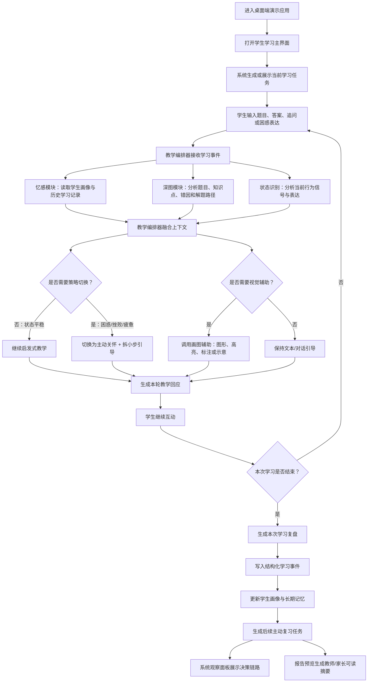
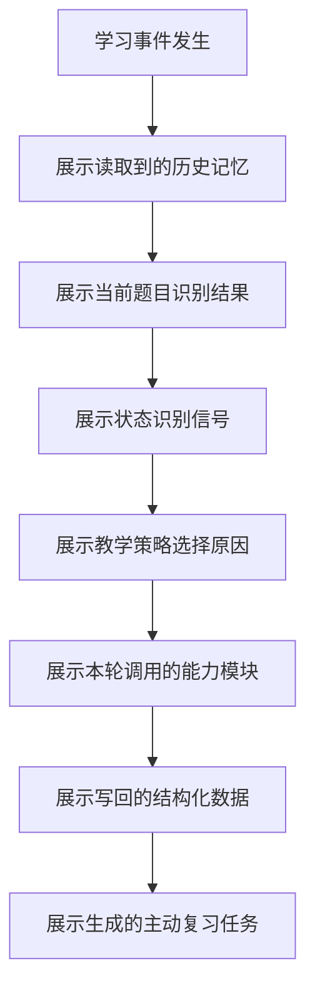
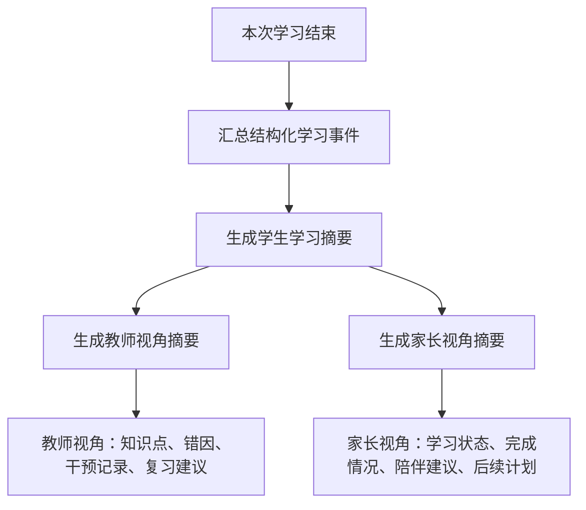

# MVP 核心流程说明

## 1. 流程定位

V0.1 的核心演示由三部分组成：

- 学生学习主界面：承载学生与灵灵老师的真实学习互动。
- 系统观察面板：展示系统读取了什么、判断了什么、为什么切换策略、写回了什么。
- 报告预览：展示未来面向教师和家长的学习摘要与建议。

主流程的目标是证明：

> 灵灵老师不是普通 AI 问答工具，而是能基于长期记忆、主动感知、启发式教学、幽默调节和画图辅助，形成结构化学习闭环的 AI 伴学系统。

## 2. MVP 主流程

## 3. 系统观察面板流程

系统观察面板不是正式学生功能，而是 V0.1 演示和验证用的辅助界面。

观察面板需要让观众看到：

- 读取了哪些历史学习记录。
- 当前题目命中了哪些知识点或薄弱点。
- 系统检测到哪些状态信号。
- 教学编排器为什么改变策略。
- 本次学习写回了哪些数据。
- 后续复习任务如何产生。

## 4. 报告预览流程

报告预览用于证明系统未来可以服务教师和家长，但 V0.1 不实现完整教师端和家长端。

报告预览不展示完整原始对话，优先展示结构化摘要和可操作建议。

## 5. 流程边界

V0.1 主流程不处理以下内容：

- 完整教师端后台。
- 完整家长端。
- 班级管理。
- 支付、订阅、账号找回。
- 真实学校或区域教育平台接入。
- 全学段、全学科、全题型覆盖。
- 心理诊断或心理治疗。

V0.1 的重点是跑通一条可解释、可演示、可沉淀数据的学习闭环。

